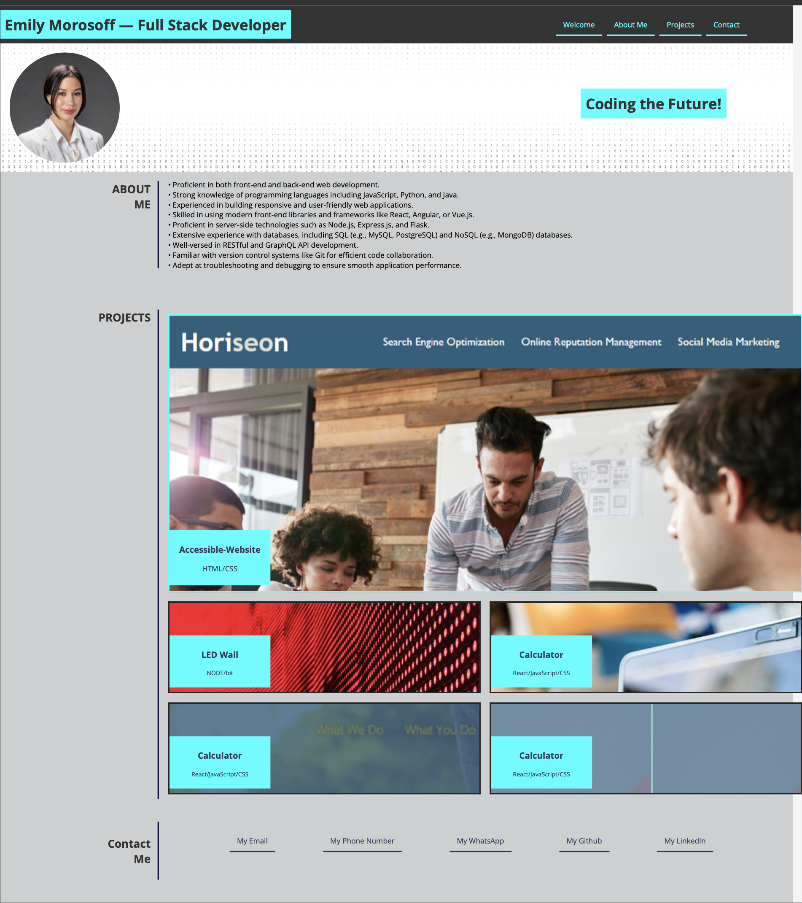

# Emily Morosoff's Portfolio

## 🌟 Welcome to Emily Morosoff's Portfolio 🌟

Welcome to my web development portfolio! Here, you can dive into my projects, explore my skills, and learn more about me.

### 📝 Portfolio Functionality

This portfolio is designed to showcase my web development skills and offers the following features:

- **Developer Information:** Discover my identity with my name and a recent photo or avatar on the homepage.
- **Easy Navigation:** Use the menu to effortlessly access sections about me, my projects, and how to get in touch.
- **Smooth Scrolling:** Clicking on navigation links smoothly scrolls to the relevant sections, ensuring a seamless user experience.
- **Project Showcase:** Explore my web development projects, with the first project image standing out.
- **Project Links:** Simply click on project images to visit the deployed applications.
- **Responsive Design:** The portfolio adapts gracefully to various screen sizes and devices, ensuring an optimal viewing experience.

### 🛠 Technologies Utilized

This portfolio is crafted using the following technologies:

- HTML
- CSS

### 🎨 Featured Projects

Dive into some of my notable projects:

1. [Accessible-Website](https://github.com/emilymorosoff/Horiseon-Accessible-Website) (HTML/CSS)
2. **Placeholder for Upcoming Project** (NODE/IoT) - *Coming Soon*
3. **Placeholder for Upcoming Project** (React/JavaScript/CSS) - *Coming Soon*
4. **Placeholder for Upcoming Project** (Placeholder Technology) - *Coming Soon*
5. **Placeholder for Upcoming Project** (Placeholder Technology) - *Coming Soon*

*Please note that tiles 2-3 are placeholders, and tiles 2-5 are coming soon.*

### 🚀 Explore My Portfolio

Ready to explore? Visit my portfolio on GitHub Pages:

[View Emily Morosoff's Portfolio](https://emilymorosoff.github.io/e-portfolio/)

### 📌 Important Details

- For the source code and additional information, check out my GitHub repository.
- If you have any questions or need assistance, don't hesitate to reach out to me.

Thank you for taking the time to explore my portfolio! 🙌

🙌 Credits

- Special thanks to OpenAI's ChatGPT-4 for assistance in generating this README.md template.
- Immense gratitude to my Preply tutor, Jaba from Romania, for refining my repository structure and base code after the initial commits.
